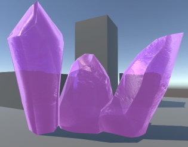

# Opaque Texture Shaders

A collection of shaders relying on Opaque Texture (Camera Color Texture).

> The project uses Unity 2021.3.0f1 and URP 12.1.6.

## Shaders

- Refractions (Shader Graph)

- Shockwave (ShaderLab/HLSL)

